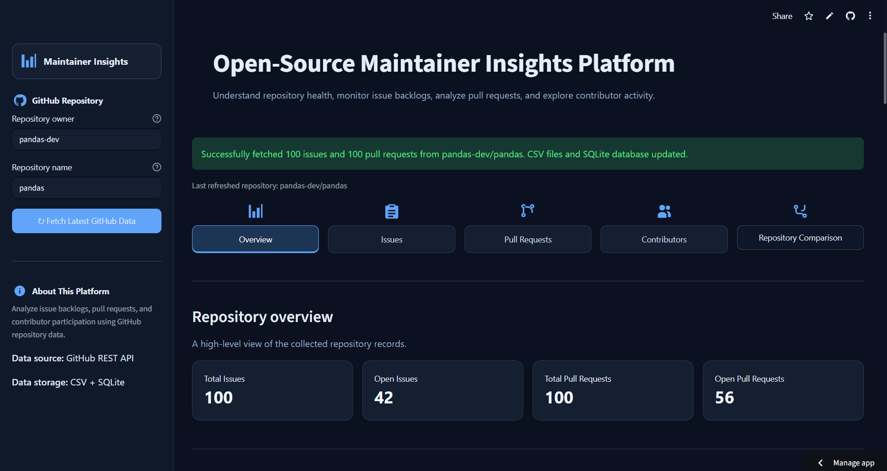
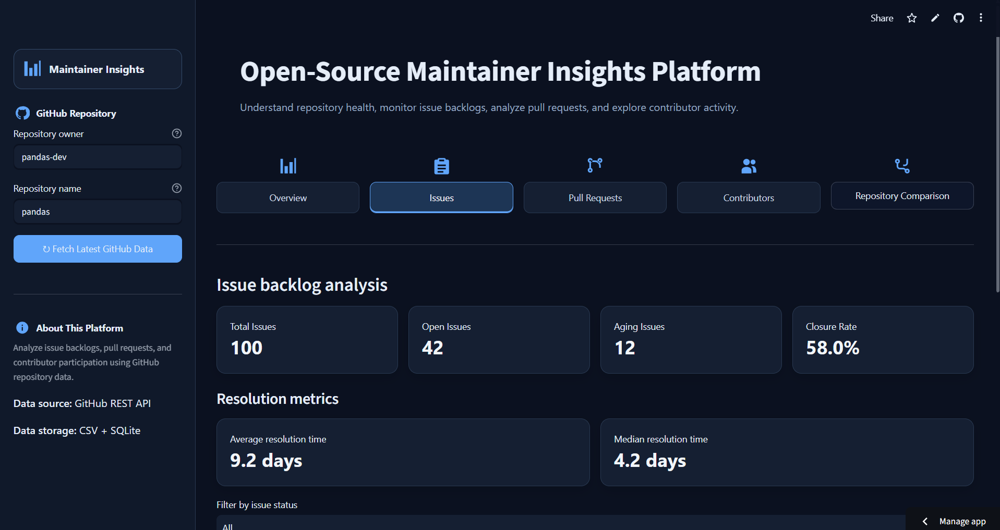
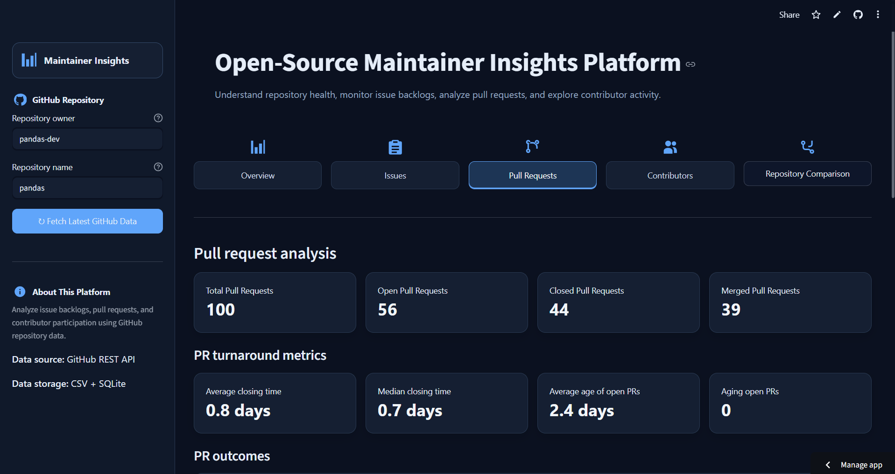
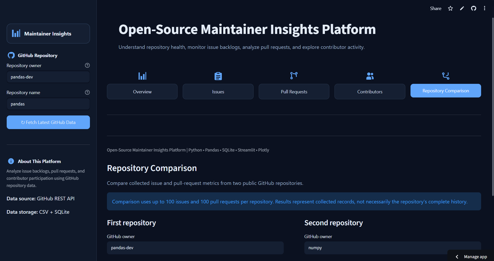

# Open-Source Maintainer Insights Platform

A Python-based dashboard for analyzing GitHub repository health through issue tracking, pull-request analytics, contributor activity, and repository comparison.

**Live Demo:** [Open the application](https://maintainer-insights-platform-pqusrlkpruxdbw7j4ddj9c.streamlit.app/)
**GitHub Repository:** [shivaniipr/maintainer-insights-platform](https://github.com/shivaniipr/maintainer-insights-platform)

---

## Overview

Maintaining an open-source project involves more than writing code. Maintainers need to understand issue backlogs, monitor pull requests, review contributor participation, and identify potential maintenance bottlenecks.

The Open-Source Maintainer Insights Platform collects publicly available GitHub issue and pull-request data and presents useful metrics through an interactive Streamlit dashboard.

The platform is designed as a modular project using Python, Pandas, the GitHub REST API, SQLite, SQLAlchemy, Plotly, and pytest.

## Features

### 1. Overview

* Summarizes collected issues and pull requests.
* Displays key repository health metrics.
* Visualizes issue and pull-request status.
* Shows resolution and closing-time statistics where data is available.

### 2. Issues

* Displays collected issue records.
* Distinguishes open and closed issues.
* Highlights aging issues.
* Reports issue closure rates and resolution-time metrics.
* Supports filtering and CSV downloads.

### 3. Pull Requests

* Summarizes open and closed pull requests.
* Reports merge-related and closing-time metrics where available.
* Supports filtering and CSV downloads.
* Helps identify potential pull-request backlogs.

### 4. Contributors

* Summarizes usernames appearing in the collected issue and pull-request records.
* Visualizes contributors with the most collected records.
* Displays a contributor summary table.
* Supports downloading the summary as a CSV file.

Contributor counts represent records collected by this application, not every contribution made by each GitHub user.

### 5. Repository Comparison

* Compares two public GitHub repositories side by side.
* Displays issue and pull-request metrics for both repositories.
* Compares open and aging issues.
* Compares open and merged pull requests.
* Visualizes selected metrics using interactive charts.

**Comparison scope:** Each repository comparison collects up to 100 issues and up to 100 pull requests. Results therefore represent the collected records, not necessarily the repository's complete history.

## Dashboard Screenshots

### Overview



### Issues



### Pull Requests



### Repository Comparison




## Technology Stack

| Technology                | Purpose                                       |
| ------------------------- | --------------------------------------------- |
| Python                    | Application logic and data processing         |
| Pandas                    | Data cleaning, transformation, and analytics  |
| GitHub REST API           | Collecting public issue and pull-request data |
| SQLite                    | Local relational data storage                 |
| SQLAlchemy                | Database integration                          |
| Streamlit                 | Interactive web dashboard                     |
| Plotly                    | Charts and data visualizations                |
| pytest                    | Automated testing                             |
| Git and GitHub            | Version control and source-code hosting       |
| Streamlit Community Cloud | Application deployment                        |

## Project Structure

```text
maintainer-insights-platform/
├── app.py
├── requirements.txt
├── README.md
├── .gitignore
├── assets/
│   └── maintainer_logo.svg
├── data/
│   ├── issues.csv              # Generated locally
│   ├── pull_requests.csv       # Generated locally
│   └── [SQLite database]      # Generated locally
├── src/
│   ├── api/
│   │   └── data_collector.py
│   ├── analytics/
│   │   ├── metrics.py
│   │   └── repository_comparison.py
│   └── database/
│       └── db.py
└── tests/
    ├── test_data_collector.py
    ├── test_metrics.py
    └── test_repository_comparison.py
```

This is a simplified view of the project's key files. Confirm the actual filenames and folders in your checkout before treating it as an exhaustive directory listing.

## Getting Started

### Prerequisites

* Python installed on your system.
* Git installed on your system.
* An internet connection for fetching GitHub repository data.

### 1. Clone the repository

```powershell
git clone https://github.com/shivaniipr/maintainer-insights-platform.git
cd maintainer-insights-platform
```

### 2. Create a virtual environment

On Windows PowerShell:

```powershell
python -m venv .venv
```

### 3. Activate the environment

```powershell
.\.venv\Scripts\Activate.ps1
```

If PowerShell blocks script execution, use an appropriate environment-specific activation method or follow your system's Python environment guidance.

### 4. Install dependencies

```powershell
python -m pip install --upgrade pip
pip install -r requirements.txt
```

### 5. Run the dashboard

```powershell
python -m streamlit run app.py
```

Streamlit will display a local URL in the terminal, usually:

```text
http://localhost:8501
```

Open that URL in your browser.

## Using the Application

1. Open the dashboard.
2. Enter a public GitHub repository owner and repository name in the sidebar.
3. Fetch the latest available issue and pull-request data.
4. Explore the Overview, Issues, Pull Requests, and Contributors sections.
5. Open Repository Comparison, enter two public repositories, and select **Compare repositories**.
6. Use available filters and download options to explore or export supported datasets.

The comparison workflow keeps comparison data in the current Streamlit session rather than overwriting the dashboard's primary CSV files.

## Analytics and Metrics

The dashboard includes metrics such as:

* Total, open, and closed issues.
* Aging issues and aging issue percentage.
* Issue closure rate.
* Average and median issue resolution time.
* Total and open pull requests.
* Aging open pull requests.
* Pull-request closure and merge rates when the required data is available.
* Average and median pull-request closing time.
* Contributor activity based on collected records.

Time-based metrics depend on the availability and validity of timestamps. Percentages and durations should be interpreted in the context of the collected dataset.

## Data Collection and Limitations

* The application uses the GitHub REST API to retrieve public repository information.
* The collector currently retrieves up to 100 issues and 100 pull requests per repository for a collection operation.
* GitHub API rate limits and network availability can affect data collection.
* The dataset is a limited sample, not a complete historical record of every issue, pull request, or contribution.
* Contributor summaries count appearances in collected issue and pull-request records, not commits or all contribution types.
* SQLite and CSV files are used for local persistence; their availability and persistence depend on the deployment environment.
* Repository comparison data is held in the current Streamlit session and is not intended as permanent comparison history.

## Testing

The project uses pytest for automated testing of data collection, metrics, and repository comparison.

The current test suite contains **15 tests**.

Run all tests:

```powershell
python -m pytest -v
```

Run only the repository comparison tests:

```powershell
python -m pytest tests/test_repository_comparison.py -v
```

The test suite covers successful data collection, API error handling, metric calculations, repository comparison summaries, and empty datasets.

## Future Improvements

Potential future enhancements include:

* Historical repository trends and time-series analysis.
* Additional maintainer health indicators.
* Improved caching and more efficient API pagination.
* Broader automated testing, including UI and integration tests.
* Continuous integration using GitHub Actions.
* More configurable comparison metrics and visualizations.

These are possible enhancements, not claims about currently implemented features.

## License

This project is licensed under the MIT License. See the LICENSE file for details.

## Author and Repository

**Repository:** [shivaniipr/maintainer-insights-platform](https://github.com/shivaniipr/maintainer-insights-platform)

**Live Application:** [Maintainer Insights Platform](https://maintainer-insights-platform-pqusrlkpruxdbw7j4ddj9c.streamlit.app/)
