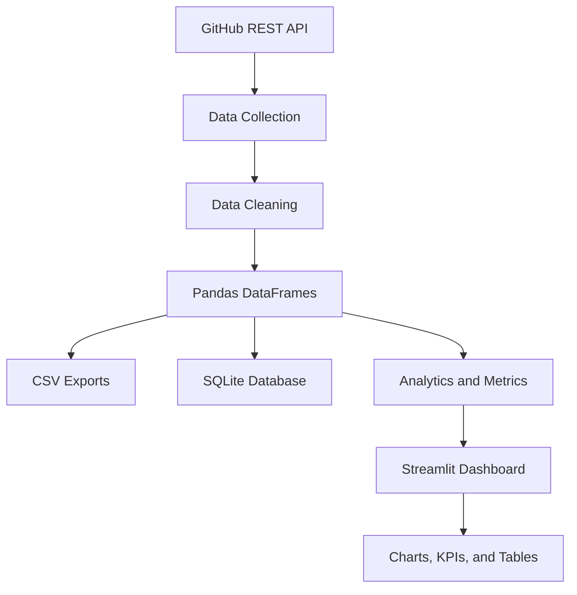

# Open-Source Maintainer Insights Platform

A data analytics dashboard that helps open-source maintainers understand repository activity, monitor issue backlogs, analyze pull requests, and explore contributor participation using GitHub data.

## Overview

Managing an active open-source repository involves more than writing code. Maintainers must track incoming issues, monitor pull requests, identify aging tasks, and understand how contributors participate in the project.

The **Open-Source Maintainer Insights Platform** collects publicly available repository data from the GitHub REST API, processes it using Python and Pandas, stores it in a local SQLite database, and presents actionable insights through an interactive Streamlit dashboard.

## Features

* **Repository analytics:** View issue and pull request activity for a selected GitHub repository.
* **Issue monitoring:** Track open and closed issues and identify open issues older than 30 days.
* **Pull request analysis:** Explore open and closed pull requests and calculate the average age of open pull requests.
* **Contributor insights:** Analyze participation using issue and pull request activity.
* **Interactive dashboard:** Explore metrics, charts, and filtered tables through a clean interface.
* **Data export:** Download issue and pull request records as CSV files.
* **Local persistence:** Store collected repository records in SQLite.
* **Automated tests:** Validate core analytics calculations using pytest.

## Technology Stack

| Technology      | Purpose                                     |
| --------------- | ------------------------------------------- |
| Python          | Application logic and data processing       |
| GitHub REST API | Retrieve public repository data             |
| Pandas          | Data cleaning, transformation, and analysis |
| SQLite          | Local database storage                      |
| SQLAlchemy      | Database connectivity and SQL operations    |
| Streamlit       | Interactive dashboard                       |
| Plotly          | Data visualizations                         |
| Pytest          | Automated testing                           |

## Architecture



## Project Structure

```text
maintainer-insights-platform/
├── app.py
├── requirements.txt
├── src/
│   ├── api/
│   │   ├── github_client.py
│   │   └── data_collector.py
│   ├── analytics/
│   │   └── metrics.py
│   └── database/
│       └── db.py
├── tests/
│   └── test_metrics.py
└── data/
    ├── issues.csv
    ├── pull_requests.csv
    └── maintainer_insights.db
```

The `data/` directory contains generated datasets and the local SQLite database. Generated database files should not be committed to the public repository.

## Getting Started

### Prerequisites

* Python 3.11 or later, subject to compatibility with the installed dependencies
* Git
* Internet access to retrieve public GitHub repository data

### 1. Clone the repository

```bash
git clone https://github.com/YOUR_USERNAME/maintainer-insights-platform.git
cd maintainer-insights-platform
```

Replace `YOUR_USERNAME` with your GitHub username after publishing the repository.

### 2. Create a virtual environment

**Windows PowerShell**

```powershell
python -m venv .venv
.\.venv\Scripts\Activate.ps1
```

If PowerShell blocks activation, consult the Python documentation for virtual-environment activation options appropriate to your system.

### 3. Install dependencies

```powershell
python -m pip install -r requirements.txt
```

### 4. Run the dashboard

```powershell
python -m streamlit run app.py
```

Streamlit will display a local URL in the terminal. Open that URL in your browser.

### 5. Run the tests

```powershell
python -m pytest -v
```

## How to Use

1. Launch the Streamlit application.
2. Enter a GitHub repository owner and repository name in the sidebar.
3. Fetch the repository data.
4. Explore the Overview dashboard for key metrics and visualizations.
5. Use the Issues and Pull Requests tabs to filter and inspect records.
6. Open the Contributors tab to review contributor activity.
7. Download the available datasets as CSV files when needed.

## Metrics

### Issue metrics

* Total issues collected
* Open issues
* Closed issues
* Aging issues, defined as open issues created more than 30 days ago

### Pull request metrics

* Total pull requests collected
* Open pull requests
* Closed pull requests
* Average age of open pull requests

**Important:** A closed pull request is not necessarily a merged pull request. Merge-specific analysis requires collecting and processing the relevant GitHub API fields.

## Testing

The project includes automated tests for:

* Issue metric calculations
* Pull request metric calculations
* Empty dataset handling

Run the test suite with:

```powershell
python -m pytest -v
```

## Current Limitations

* The current collector uses a limited number of API results per request; comprehensive repository analysis will require pagination.
* GitHub imposes API rate limits. Unauthenticated requests have lower limits than authenticated requests.
* The current contributor view measures recorded issue and pull request participation, not the complete contribution history of each person.
* SQLite is intended for local development and demonstration. A deployed application requiring durable shared storage should use a suitable persistent database.
* Metrics describe the collected snapshot and should not be interpreted as a complete historical analysis.

## Future Improvements

* Implement API pagination and improved error handling.
* Add GitHub token support using secure environment variables.
* Track merged pull requests and calculate merge turnaround time.
* Add repository activity trends over time.
* Improve contributor-level analytics.
* Expand automated tests and continuous integration.
* Deploy the dashboard for public demonstration.
* Document beginner-friendly contribution opportunities.

## Contributing

Contributions, bug reports, and suggestions are welcome. Please open an issue to discuss a significant change before submitting a pull request. Contribution instructions will be documented in `CONTRIBUTING.md`.

## License

This project is intended to be released under the MIT License. The repository should include a `LICENSE` file containing the complete license text before publication.

---

**Built with Python, Pandas, GitHub REST API, SQLite, and Streamlit.**
